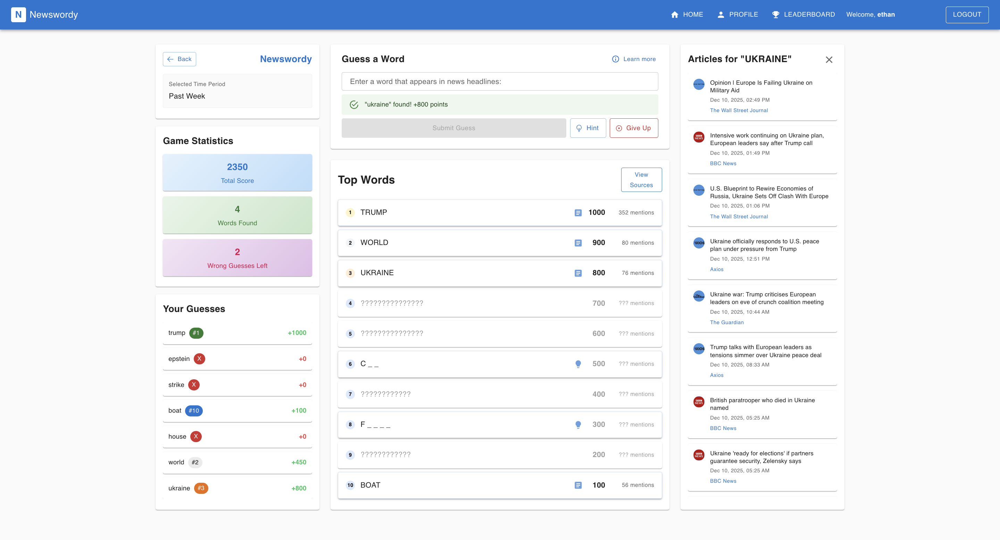

# Newswordy

A web game similar to Google Feud where users guess the most common words in news article headlines for different time periods. Test your knowledge of current events by predicting which words appear most frequently in recent news!

🌐 **Live Demo**: [newswordy.vercel.app](https://newswordy.vercel.app)


## Game Concept

Players select a time range (past day, week, month, year, etc.) and try to guess the most frequently occurring words in news headlines from that period. Points are awarded based on how common the guessed words are, similar to Google Feud mechanics.

### Game Modes

- **Classic Mode**: Guess the most common words from recent news headlines across all selected sources
- **Source Comparison**: Compare word usage between two groups of sources. Find words that appear more in one group than the other
- **Word Association**: Choose an anchor word and guess words that frequently appear together with it in headlines
- **Comparative Association**: Compare word usage between two groups of sources with a selected anchor word


## Tech Stack

- **Frontend**: React 19 + TypeScript + Tailwind CSS + Material-UI
- **Database**: Supabase (PostgreSQL) with custom functions for word frequency queries
- **Scraping**: Python 3.11 with BeautifulSoup, feedparser, SQLAlchemy
- **Deployment**: Vercel (frontend)
- **Authentication**: Auth0
- **CI/CD**: GitHub Actions (scheduled scraping runs twice daily)

## Architecture

This is a serverless application with no traditional backend API:
- Frontend communicates directly with Supabase using PostgreSQL functions
- Python scraper runs via GitHub Actions (scheduled twice daily at 1 AM and 1 PM UTC)
- News articles and word frequencies are stored in PostgreSQL
- Real-time game data is fetched using Supabase client library

## Project Structure

```
newswordy/
├── frontend/                 # React TypeScript application
│   ├── src/
│   │   ├── components/       # Reusable UI components
│   │   ├── pages/            # Game pages and routes
│   │   ├── services/         # API and Supabase client
│   │   └── types/            # TypeScript type definitions
│   └── package.json
├── scraper/                  # Python news scraping scripts
│   ├── news_scraper.py       # Main scraper logic
│   ├── word_processor.py     # Word frequency analysis
│   ├── database.py           # Database models and operations
│   ├── config.py             # News sources configuration
│   ├── scheduler.py          # Local scheduling (optional)
│   └── requirements.txt
├── supabase/                 # Database schema and SQL functions
│   ├── schema.sql            # Complete database schema
│   └── functions/            # RPC functions (SQL)
└── .github/
    └── workflows/
        └── run-scraper.yaml  # GitHub Actions workflow
```

## News Sources

The scraper collects headlines from **15+ major news sources**, including:
- ABC News, Al Jazeera, Axios, BBC News, CBS News
- Fox News, The Guardian, Los Angeles Times, NBC News
- New York Post, Newsmax, NPR, The New York Times
- The Wall Street Journal, The Washington Post, Yahoo News

The source list can easily be expanded by adding new configurations in `scraper/config.py` and `frontend/src/types` + `frontend/src/components`.


## Development Setup

### Prerequisites

- **Node.js** 18+ and npm
- **Python** 3.11+
- **Vercel account** (free tier)
- **Supabase account** (free tier)
- **Auth0 account** (free tier)
- **Git**

### Frontend Setup

1. **Clone the repository**
   ```bash
   git clone https://github.com/ethanpschoen/newswordy.git
   cd newswordy
   ```

2. **Navigate to frontend directory**
   ```bash
   cd frontend
   ```

3. **Install dependencies**
   ```bash
   npm install
   ```

4. **Set up environment variables**
   
   Create a `.env` file in the `frontend/` directory:
   ```env
   REACT_APP_SUPABASE_URL=your_supabase_project_url
   REACT_APP_SUPABASE_ANON_KEY=your_supabase_anon_key
   REACT_APP_AUTH0_DOMAIN=your_auth0_domain
   REACT_APP_AUTH0_CLIENT_ID=your_auth0_client_id
   REACT_APP_AUTH0_AUDIENCE=your_auth0_audience
   ```

5. **Start the development server**
   ```bash
   npm start
   ```
   
   The app will open at `http://localhost:3000`

### Scraper Setup

1. **Navigate to scraper directory**
   ```bash
   cd scraper
   ```

2. **Create a virtual environment (recommended)**
   ```bash
   python -m venv venv
   source venv/bin/activate  # On Windows: venv\Scripts\activate
   ```

3. **Install dependencies**
   ```bash
   pip install -r requirements.txt
   ```

4. **Download NLTK data** (required for word processing)
   ```bash
   python -c "import nltk; nltk.download('punkt'); nltk.download('punkt_tab'); nltk.download('stopwords')"
   ```

5. **Set up environment variables**
   
   Create a `.env` file in the `scraper/` directory:
   ```env
   DB_HOST=your_supabase_db_host
   DB_PORT=5432
   DB_NAME=postgres
   DB_USER=postgres
   DB_PASSWORD=your_supabase_db_password
   DATABASE_URL=your_supabase_connection_string
   ```

6. **Initialize database tables**
   ```bash
   python database.py
   ```

7. **Run the scraper manually**
   ```bash
   python news_scraper.py
   ```

8. **Optional: Run scraper with local scheduler**
   ```bash
   python scheduler.py
   ```
   This will run the scraper at 6 AM and 6 PM daily.

### GitHub Actions Setup (Automated Scraping)

1. **Set up GitHub Secrets**
   
   In your GitHub repository, go to Settings → Secrets and variables → Actions, and add:
   - `DB_HOST`
   - `DB_PORT`
   - `DB_NAME`
   - `DB_USER`
   - `DB_PASSWORD`
   - `DATABASE_URL`

2. **The workflow is already configured** in `.github/workflows/run-scraper.yaml`
   
   It runs automatically twice daily (1 AM and 1 PM UTC) and can also be triggered manually via GitHub Actions UI.



## Features

### Implemented ✅

- [x] News headline scraping from 15+ major sources
- [x] Word frequency analysis by time period
- [x] Multiple game modes (Classic, Comparison, Association, Comparative Association)
- [x] Interactive word guessing game with real-time feedback
- [x] Real-time scoring system
- [x] User authentication and profiles (Auth0)
- [x] Customizable game settings (time periods, sources, max guesses, scoreboard size)
- [x] Advanced filtering options (source selection, time range)
- [x] Word hints system (fill-in-the-blank, first letter)
- [x] Article information display for guessed words
- [x] User statistics tracking (total games, best score, average score)
- [x] Automated daily scraping via GitHub Actions

### In Progress 🚧

- [ ] Global and personal leaderboards


## Contributing

This is a personal project for learning and portfolio purposes. However, contributions, suggestions, and feedback are welcome!

If you'd like to contribute:

1. Fork the repository
2. Create a feature branch (`git checkout -b feature/amazing-feature`)
3. Commit your changes (`git commit -m 'Add some amazing feature'`)
4. Push to the branch (`git push origin feature/amazing-feature`)
5. Open a Pull Request

Please ensure your code follows the existing style and includes appropriate tests if applicable.

## License

This project is open source and available for educational purposes.

## Acknowledgments

- Inspired by Google Feud
- Built with React, Supabase, and Python
- News sources provide RSS feeds and public content

---

Made with ❤️ for news enthusiasts and word game lovers
